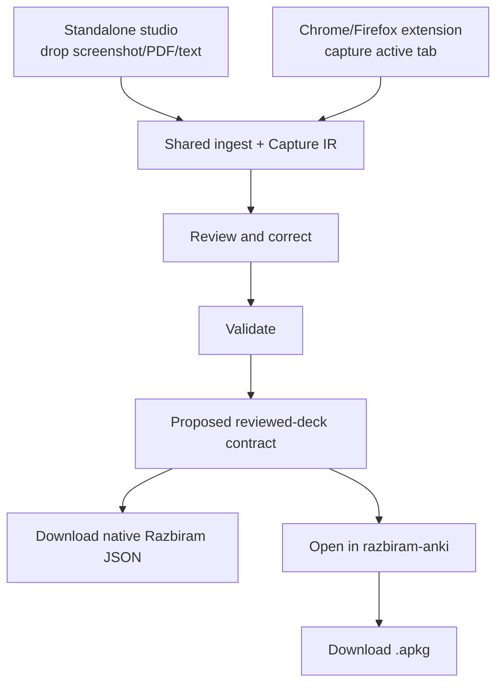
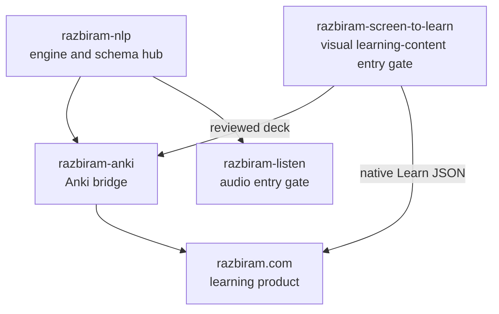

# razbiram-screen-to-learn

Turn learning screens into reviewable, evidence-backed razbiram learncards.

> Status: M0 implemented. A local studio reads screenshots, photos, text and captured HTML into
> reviewable cards, validates them, and exports a capability-gated deck. The browser extension and
> the artifact store are still design only.

## Getting started

```sh
./start.sh          # builds the UI if needed, then serves it on http://127.0.0.1:8765
./start.sh --help   # options
```

Everything runs on your machine. There is no account, no telemetry, and captured content is never
sent anywhere.

### Prerequisites

| | Needed for |
|---|---|
| Python 3.11+ | the pipeline |
| Node.js | building the studio UI |
| **`tesseract`** | **reading images** — without it, text and HTML still work but any screenshot or photo is refused with a clear message |

```sh
brew install tesseract tesseract-lang            # macOS
sudo apt install tesseract-ocr tesseract-ocr-bul # Debian/Ubuntu
```

Extra language packs are picked up automatically if present; there is no language setting to
choose, because this tool reads material rather than teaching a language.

## What it does, on a real quiz

Drop this — as a screenshot, or pasted as text. The same extractor runs either way:

```text
Biology — practice test

1. Which organ produces insulin?
A) Liver
B) Pancreas
C) Kidney
D) Spleen

2. Select all that apply. Which of these are metals?
A) Iron
B) Oxygen
C) Copper
D) Helium

3. A photon has zero rest mass.
A) True
B) False

Answers:
1. B
2. A, C
3. A
```

Three questions, three different families, one trailing key. The studio reports
`3 cards extracted · 3 exportable · 0 blocked`, and the export carries all three shapes —
abridged below, but copied from an actual run:

```jsonc
{
  "schemaId": "studywithme-bg.learncard.v1",
  "cards": [
    { "cardId": "q-0001", "type": "mcq",
      "question": { "und": "Which organ produces insulin?" },
      "correctAnswer": "Pancreas",                        // read from "1. B", not guessed
      "options": [ { "text": "Liver", "isCorrect": false },
                   { "text": "Pancreas", "isCorrect": true } /* … */ ],
      "scoring": { "mode": "single-best-answer", "points": 1 } },

    { "cardId": "q-0002", "type": "mcq",
      "selectionMode": "multiple",                        // both answers survive — never collapsed
      "question": { "und": "Select all that apply. Which of these are metals?" },
      "options": [ { "optionId": "opt_5d78ff…", "text": "Iron",   "isCorrect": true },
                   { "optionId": "opt_7a45b4…", "text": "Oxygen", "isCorrect": false },
                   { "optionId": "opt_3c7313…", "text": "Copper", "isCorrect": true } /* … */ ],
      "correctOptionIds": [ "opt_5d78ff…", "opt_3c7313…" ],
      "scoring": { "mode": "all-or-nothing", "points": 1 } },

    { "cardId": "q-0003", "type": "mcq",
      "sourceFormat": "true-false",                       // own IR family; two-option MCQ only here
      "question": { "und": "A photon has zero rest mass." },
      "correctAnswer": "True",
      "options": [ { "text": "True", "isCorrect": true },
                   { "text": "False", "isCorrect": false } ] }
  ]
}
```

### The same quiz without its answer key

Delete the `Answers:` block and nothing is exportable. The material never says which option is
right, and this tool does not decide that for you:

```text
Nothing is exportable yet — every card was excluded
  q-0001 — answerEvidenceTier 'source-ambiguous' is not exportable;
           needs one of ['reviewer-confirmed', 'source-verified']
  q-0002 — …
```

The cards are still there to look at. The editor opens on a **draft**: every recognised card in
target shape, with the answer left explicitly empty instead of guessed.

```jsonc
{ "cardId": "q-0001", "type": "mcq",
  "question": { "und": "Which organ produces insulin?" },
  "correctAnswer": "",                                    // ← you fill this in
  "options": [ { "text": "Liver",    "isCorrect": false },
               { "text": "Pancreas", "isCorrect": false }, // nothing pre-selected, on purpose
               { "text": "Kidney",   "isCorrect": false },
               { "text": "Spleen",   "isCorrect": false } ] }
```

Download stays disabled, and `POST /v1/deck/check` — the same rules the export path enforces —
says what is missing:

```text
card q-0001: mark exactly one correct option, 0 are marked
card q-0002: mark at least one correct option (correctOptionIds is empty)
```

Mark the answers the material shows, and Download turns green. That round trip is the human
release gate: a pre-filled guess someone confirms is indistinguishable from a fabricated answer,
so there is never a guess to confirm — including when the extractor did form an opinion at a tier
too weak to export.

### Known limits

- **A question number that OCR fails to read costs that question its answer key.** Blocks inherit
  the last number seen, so a key row can bind to the neighbouring question — wrong, and quiet.
  Pasting the text avoids it. Until it is fixed, read the review list before exporting a deck that
  came from a screenshot.
- PDF intake, the browser extension and the artifact store are design only.

## Decision

**Conditional GO.** The product is technically feasible if it is built as a content-first,
local-first capture pipeline rather than as screenshot-only OCR:

1. the standalone studio accepts screenshots, PDFs, pasted text, and capture bundles;
2. a separately downloadable Chrome/Firefox extension reads visible DOM/accessibility content
   from the active user-authorized tab and captures matching visual evidence;
3. question and answer-reveal states are joined into one evidence bundle;
4. both entry channels feed one Capture IR, validator, review flow, and exporter;
5. a deterministic validator blocks missing, contradictory, or unsupported answers;
6. a human reviews the cards before export.

The standalone application remains fully usable without the extension. The downloadable
extension is a convenience and discovery channel: it captures directly from the student's
existing browser session and either transfers to the local studio or downloads a portable
`.razcapture` bundle.

## Scope

The pipeline targets the card families already supported by razbiram:

- single-choice MCQ;
- matching;
- typed recall;
- flashcard;
- image occlusion.

It additionally specifies the two missing platform capabilities:

- multiple-select MCQ;
- true/false.

True/false can be exported compatibly as a two-option single-choice MCQ. Multiple-select requires
a coordinated, additive razbiram.com runtime change; the exporter must block it until the target
declares that capability. It must never collapse several correct answers into one.

## Two acquisition options



## Architecture package

- [German product brief](docs/product/PRODUCT_BRIEF.de.md)
- [Feasibility assessment](docs/evaluation/FEASIBILITY.md)
- [Solution architecture](docs/architecture/SOLUTION_ARCHITECTURE.md)
- [Upstream reuse inventory](docs/architecture/UPSTREAM_REUSE.md)
- [Browser capture design](docs/architecture/BROWSER_CAPTURE.md)
- [Chrome/Firefox extension](docs/architecture/BROWSER_EXTENSION.md)
- [Standalone input channels](docs/architecture/INPUT_CHANNELS.md)
- [Pipeline and state machine](docs/architecture/PIPELINE.md)
- [Data contracts](docs/architecture/DATA_CONTRACTS.md)
- [razbiram integration](docs/architecture/RAZBIRAM_INTEGRATION.md)
- [razbiram-anki bridge](docs/architecture/RAZBIRAM_ANKI_BRIDGE.md)
- [Security, privacy, and legal boundaries](docs/architecture/SECURITY_PRIVACY_LEGAL.md)
- [Corporate identity](docs/design/CORPORATE_IDENTITY.md)
- [Golden-set evaluation plan](docs/evaluation/GOLDEN_SET.md)
- [Implementation roadmap](docs/ROADMAP.md)
- [Repository blueprint](docs/architecture/REPOSITORY_BLUEPRINT.md)
- [Decision records](docs/decisions/)

## Reuse baseline

The design was evaluated against the local checkout of
[`abi/screenshot-to-code`](https://github.com/abi/screenshot-to-code), commit
`6094fd710becd981fbcf29cfc32d7ebef921866d` (2026-07-24).

Reusable patterns include its FastAPI/WebSocket separation, provider-normalized streaming,
Playwright browser reuse, screenshot backend registry, image/data-URL validation, run recording,
and evaluation structure. Its URL capture uses ScreenshotOne, and its local Playwright backend
only renders generated HTML; neither implements authenticated learning-site navigation. That
capture layer is new work for this project.

See [THIRD_PARTY_NOTICES.md](THIRD_PARTY_NOTICES.md) before copying source.

The `razbiram-anki` baseline was also audited at commit `119bcea`. Its proven Anki/CrowdAnki
round-trip should be reused downstream of review, but its current `deck.json` is not the native
LearnCard schema and cannot replace Capture IR. The integration decision is documented in
[ADR 008](docs/decisions/008-integrate-razbiram-anki-at-reviewed-deck-boundary.md).

## Ecosystem



The tool is planned as an MIT-licensed public bridge. The razbiram visual identity remains
© razbiram.com and is not relicensed by the MIT code license.

The extension may link to razbiram.com and the standalone studio as a transparent product
discovery surface. It does not inject advertising into learning cards, require an account, or
upload browsing data for marketing.

## Development discipline

This Bridge/Tool repo follows the binding `dev/base/CONSTITUTION.md` and the Razbiram family
contract. The deterministic root gate is:

```bash
./scripts/state.sh
./scripts/gate.sh
```

Implementation starts with the M0 vertical slice; the architecture documents are plans, not
claims that runtime code already exists.

Built by [Leon Köllerwirth Hlihel](https://leon-koellerwirth.com) — AI governance & agentic
engineering in regulated environments.
