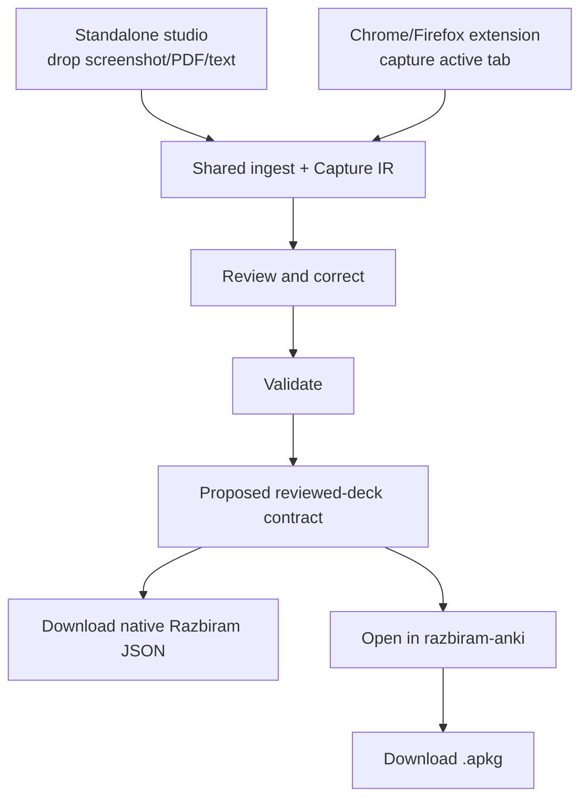
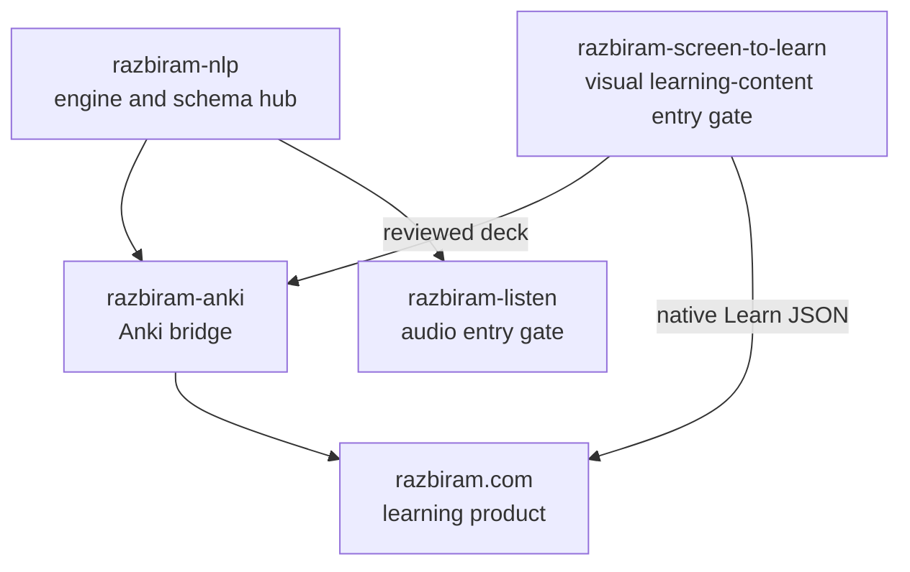

# razbiram-screen-to-learn

Turn learning screens into reviewable, evidence-backed razbiram learncards.

> Status: architecture and feasibility package. No production implementation exists in this
> directory yet.

## Decision

**Conditional GO.** The product is technically feasible if it is built as a content-first,
local-first capture pipeline rather than as screenshot-only OCR:

1. the standalone studio accepts screenshots, PDFs, pasted text, and capture bundles;
2. a separately downloadable Chrome/Firefox extension reads visible DOM/accessibility content
   from the active user-authorized tab and captures matching visual evidence;
3. question and answer-reveal states are joined into one evidence bundle;
4. both entry channels feed one Capture IR, validator, review flow, and exporter;
5. a deterministic validator blocks missing, contradictory, or unsupported answers;
6. a human reviews the cards before export.

The standalone application remains fully usable without the extension. The downloadable
extension is a convenience and discovery channel: it captures directly from the student's
existing browser session and either transfers to the local studio or downloads a portable
`.razcapture` bundle.

## Scope

The pipeline targets the card families already supported by razbiram:

- single-choice MCQ;
- matching;
- typed recall;
- flashcard;
- image occlusion.

It additionally specifies the two missing platform capabilities:

- multiple-select MCQ;
- true/false.

True/false can be exported compatibly as a two-option single-choice MCQ. Multiple-select requires
a coordinated, additive razbiram.com runtime change; the exporter must block it until the target
declares that capability. It must never collapse several correct answers into one.

## Two acquisition options



## Architecture package

- [German product brief](docs/product/PRODUCT_BRIEF.de.md)
- [Feasibility assessment](docs/evaluation/FEASIBILITY.md)
- [Solution architecture](docs/architecture/SOLUTION_ARCHITECTURE.md)
- [Upstream reuse inventory](docs/architecture/UPSTREAM_REUSE.md)
- [Browser capture design](docs/architecture/BROWSER_CAPTURE.md)
- [Chrome/Firefox extension](docs/architecture/BROWSER_EXTENSION.md)
- [Standalone input channels](docs/architecture/INPUT_CHANNELS.md)
- [Pipeline and state machine](docs/architecture/PIPELINE.md)
- [Data contracts](docs/architecture/DATA_CONTRACTS.md)
- [razbiram integration](docs/architecture/RAZBIRAM_INTEGRATION.md)
- [razbiram-anki bridge](docs/architecture/RAZBIRAM_ANKI_BRIDGE.md)
- [Security, privacy, and legal boundaries](docs/architecture/SECURITY_PRIVACY_LEGAL.md)
- [Corporate identity](docs/design/CORPORATE_IDENTITY.md)
- [Golden-set evaluation plan](docs/evaluation/GOLDEN_SET.md)
- [Implementation roadmap](docs/ROADMAP.md)
- [Repository blueprint](docs/architecture/REPOSITORY_BLUEPRINT.md)
- [Decision records](docs/decisions/)

## Reuse baseline

The design was evaluated against the local checkout of
[`abi/screenshot-to-code`](https://github.com/abi/screenshot-to-code), commit
`6094fd710becd981fbcf29cfc32d7ebef921866d` (2026-07-24).

Reusable patterns include its FastAPI/WebSocket separation, provider-normalized streaming,
Playwright browser reuse, screenshot backend registry, image/data-URL validation, run recording,
and evaluation structure. Its URL capture uses ScreenshotOne, and its local Playwright backend
only renders generated HTML; neither implements authenticated learning-site navigation. That
capture layer is new work for this project.

See [THIRD_PARTY_NOTICES.md](THIRD_PARTY_NOTICES.md) before copying source.

The `razbiram-anki` baseline was also audited at commit `119bcea`. Its proven Anki/CrowdAnki
round-trip should be reused downstream of review, but its current `deck.json` is not the native
LearnCard schema and cannot replace Capture IR. The integration decision is documented in
[ADR 008](docs/decisions/008-integrate-razbiram-anki-at-reviewed-deck-boundary.md).

## Ecosystem



The tool is planned as an MIT-licensed public bridge. The razbiram visual identity remains
© razbiram.com and is not relicensed by the MIT code license.

The extension may link to razbiram.com and the standalone studio as a transparent product
discovery surface. It does not inject advertising into learning cards, require an account, or
upload browsing data for marketing.

## Development discipline

This Bridge/Tool repo follows the binding `dev/base/CONSTITUTION.md` and the Razbiram family
contract. The deterministic root gate is:

```bash
./scripts/state.sh
./scripts/gate.sh
```

Implementation starts with the M0 vertical slice; the architecture documents are plans, not
claims that runtime code already exists.

Built by [Leon Köllerwirth Hlihel](https://leon-koellerwirth.com) — AI governance & agentic
engineering in regulated environments.
