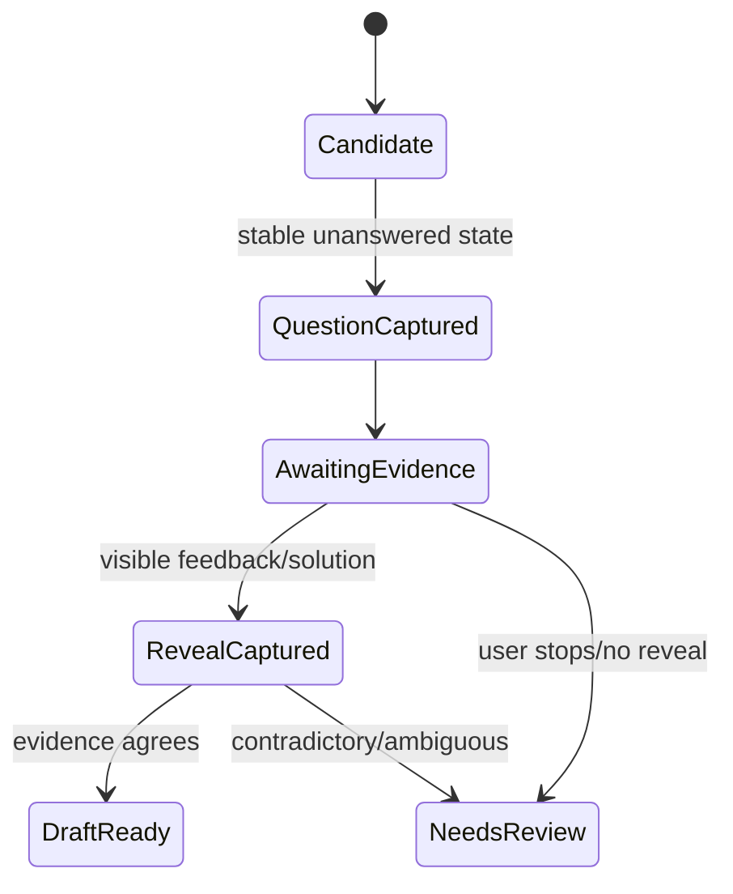

# Browser capture design

## Capture modes

### 1. Chrome/Firefox extension

The extension captures the explicitly authorized active tab in the student's existing browser.
It sends a sanitized DOM/ARIA snapshot plus visible screenshot to a paired studio or downloads a
portable `.razcapture` bundle.

Advantages:

- no second login or separate browsing profile;
- strong semantic evidence from the page;
- low-friction, downloadable Razbiram product surface;
- Capture Lite remains useful without the standalone app.

Constraints:

- temporary active-tab permission is the default; observe mode requires a narrow origin grant;
- the screenshot API sees the visible viewport, not arbitrary hidden content;
- extension stores and browser differences add release work;
- the page still has to reveal a correct answer or the reviewer must confirm it.

The complete permission, transport, packaging, and acquisition design is in
[BROWSER_EXTENSION.md](BROWSER_EXTENSION.md).

### 2. Controlled Playwright browser — fallback and test adapter

The tool launches visible Chromium with a dedicated profile. The user performs login, MFA, and
navigation directly. The tool observes only while a capture session is visibly active.

Advantages:

- stable browser API;
- full DOM and screenshot access;
- isolated cookies/profile;
- deterministic test fixtures;
- no broad extension permission.

Constraints:

- it is a separate browser profile;
- some managed platforms may block automation;
- CAPTCHA remains a user interaction and is never bypassed.

### 3. File/import adapter

Static screenshots, PDFs, and text supplied by the user enter the same artifact contract. This
path has weaker structure and therefore a higher review requirement. See
[INPUT_CHANNELS.md](INPUT_CHANNELS.md).

## Source policy

Each session declares one policy:

| Policy | Navigation | Automatic observation | Automatic next-click |
|---|---|---|---|
| `user-upload` | local fixture/file | yes | n/a |
| `first-party-owned` | allowlisted origin | yes | only with explicit bounded recipe |
| `permission-confirmed` | allowlisted origin | yes | only with documented permission |
| `third-party-observe` | user navigation only | current task container only | never |

The default is `third-party-observe`.

No policy permits hidden APIs, credential capture, CAPTCHA/DRM/paywall bypass, or access beyond
what the user can visibly open.

## Capture bundle

One stable page state produces:

```text
capture manifest
├── sanitized URL (scheme + host + path; no credentials/query/fragment)
├── title, viewport, locale, timestamp
├── semantic snapshot
│   ├── visible normalized text
│   ├── roles/names/states for relevant controls
│   ├── local stable node references
│   └── bounding boxes
├── question-container PNG
├── optional full viewport PNG (private, short retention)
├── resource/console diagnostics (redacted, opt-in)
└── SHA-256 hashes
```

Do not store cookies, storage state, request headers, password fields, hidden form values,
authorization tokens, or raw page scripts.

## DOM/semantic snapshot

The injected capture function is deterministic and read-only:

- walks visible nodes under the selected/candidate container;
- records text from rendered nodes;
- resolves labels for radio/checkbox/button/input roles;
- records `checked`, `disabled`, `expanded`, and feedback-relevant attributes;
- records bounding boxes in normalized viewport coordinates;
- descends open shadow roots;
- treats cross-origin iframes as screenshot-only unless separately user-approved;
- strips scripts, styles, event handlers, URLs with query/fragment, and form values;
- caps nodes, depth, text length, and runtime.

The snapshot is data, never executable HTML.

## Question detection

Generic detection scores candidate containers using:

- a question-like text block;
- 2–8 radio/checkbox/button options;
- shared form/fieldset/list container;
- accessible group name/legend;
- visible submit/check control;
- geometry: question and options in one region;
- state changes after answer/reveal.

The user can select a container when generic detection is ambiguous. That selection creates a
session-local locator hint, not a hardcoded public-site scraper.

## State stabilization

A state is capturable when:

- DOM mutation rate stays below a threshold for 300–500 ms;
- fonts are ready or a timeout elapses;
- the candidate bounding box is stable;
- no blocking modal overlays the candidate;
- content fingerprint differs from the last accepted state, or its answer-state fingerprint
  changed.

Use debounce plus a maximum wait. Never wait on global `networkidle` alone; long-polling pages may
never become idle.

## Fingerprints

`questionFingerprint` hashes:

- normalized question text;
- normalized option texts in source order;
- card-family classification;
- sanitized origin/path scope.

`stateFingerprint` additionally hashes:

- checked states;
- correctness/feedback labels;
- revealed explanation text;
- visible answer-state classes reduced to semantic signals.

Fingerprinting prevents duplicate captures from React rerenders while allowing a question and
its reveal state to be paired.

## Answer-state pairing

The state machine stores all states for one question fingerprint:



A user's checked option before authoritative feedback is recorded as `user-selection`, not
`correct-answer`.

## Screenshot policy

- capture the smallest complete question container;
- add safe padding;
- capture full viewport only for debugging/review context;
- redact detected email/account/avatar/topbar regions when possible;
- never include browser chrome;
- normalize EXIF orientation and pixel format;
- store original and derived hashes;
- never embed full screenshots into a deck by default.

## Browser lifecycle

- one context per capture session;
- dedicated profile directory with restrictive permissions;
- explicit `Start capture`, `Pause`, and `Stop` controls;
- block unexpected downloads and pop-ups, surface them to the user;
- close pages/contexts on cancellation;
- shutdown hook terminates browser and Playwright cleanly;
- session wipe deletes evidence and optionally the dedicated profile;
- capability probe can be retried and does not permanently cache a failure.
