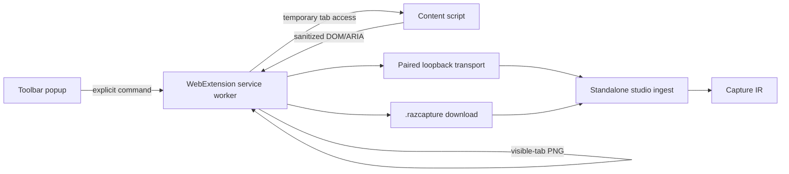

# Chrome and Firefox extension

## Product role

The extension is the downloadable, low-friction capture surface for students who already have
learning content open in their normal browser. It complements the standalone studio; it does not
replace the extraction, review, validation, or export pipeline.

Both products produce the same evidence contract:

```text
active tab → extension-capture.v1 → Capture IR → review → Razbiram JSON
file/drop  → ingest-envelope.v1   → Capture IR → review → Razbiram JSON
```

This keeps one definition of a correct card. The extension never contains a second set of
extractors or exporters.

## User journeys

### Capture once

1. The student opens the extension from the browser toolbar.
2. The popup explains exactly which active tab will be read.
3. `Capture this question` collects a sanitized semantic snapshot and a visible-tab PNG.
4. If the local studio is paired, the capture appears in its inbox.
5. Otherwise the extension downloads a portable `.razcapture` bundle.

### Observe an exercise

1. The student explicitly starts `Observe this tab`.
2. A persistent in-page indicator shows that capture is active.
3. A `MutationObserver` detects stable question and reveal states without clicking controls.
4. Candidate states are fingerprinted and deduplicated locally.
5. The student pauses or stops observation at any time.

Observe mode applies only to the selected tab and current origin. It never follows background
tabs, automatically grants another origin, or advances an exercise.

### Select a region

The student can draw a rectangle around a question, diagram, or occlusion image. The extension
stores the CSS-pixel rectangle, device-pixel ratio, element context when available, and the
matching image crop. This is especially useful for Canvas, scanned material, and image
occlusion.

### Import a document from the popup

The popup may link to the standalone studio's screenshot/PDF/text drop zone. Document parsing
stays in the studio so that browser-extension permissions and bundle size remain small.

## Architecture



Implementation shape:

- `packages/extension-core`: browser-neutral TypeScript capture, sanitization, contracts, and
  tests;
- `apps/extension/chromium`: Manifest V3 packaging and Chrome-specific adapter;
- `apps/extension/firefox`: Firefox manifest/package and compatibility adapter;
- generated types for `extension-capture.v1`, shared with the Python service;
- no React dependency is required for the small popup unless the actual UI complexity justifies
  it.

Chrome and Firefox builds are products of the same source commit. Browser-specific code is
restricted to API adapters, manifest generation, signing, and store metadata.

## Permission budget

Default permissions:

- `activeTab` for temporary access after a deliberate toolbar action;
- `scripting` to install the capture script in that tab;
- `storage` for local settings, pairing metadata, and a bounded offline queue;
- a browser-native, user-initiated download for Capture Lite; add the `downloads` permission only
  if the final implementation demonstrably needs the downloads API.

Optional host access is requested just in time when the user enables observe mode for a named
origin. Paired mode may additionally require a narrowly documented loopback host grant such as
`http://127.0.0.1/*`; it is never widened to the LAN. Optional grants are revocable in the
extension UI.

Not requested by default:

- `<all_urls>`;
- cookies;
- browsing history;
- `webRequest`;
- `debugger`;
- background access to every tab;
- clipboard read;
- microphone, camera, or desktop capture.

The release gate treats any permission expansion as a security and product decision, not as a
routine manifest change.

## What can be captured

The content script reads only the current document after authorization:

- rendered text, headings, labels, lists, tables, and form-control roles;
- radio/checkbox state and accessible names;
- stable, sanitized element relationships and bounding boxes;
- visible feedback, solution, and explanation regions;
- image references and Canvas presence without fetching hidden resources;
- the visible viewport via the browser tab-capture API.

It excludes:

- password and payment fields;
- arbitrary form values unrelated to the selected learning container;
- cookies, local-storage contents, authorization headers, and page scripts;
- hidden answer data, application state, or private APIs that are not rendered for the user;
- cross-origin iframe content unless separately and explicitly authorized by the browser.

`captureVisibleTab` captures the visible viewport, not an unlimited hidden full page. A question
outside the viewport requires deliberate scrolling or a second capture. Overlapping captures can
be joined only when geometry and fingerprints agree.

## Transport modes

### Capture Lite — no app required

Capture Lite creates a versioned `.razcapture` bundle and downloads it locally. It is a useful
capture-only mode, not a claim that a full reviewed Razbiram deck was created inside the
extension. The bundle is a ZIP-compatible container with:

```text
manifest.json                 extension-capture.v1
semantic/question.json       sanitized semantic snapshot
artifacts/viewport.png
artifacts/region-*.png        optional
checksums.sha256
```

It contains no executable page content, cookies, provider keys, or unredacted browser storage.
The studio verifies the manifest, filenames, size limits, media types, and hashes before import.

### Paired local studio

The preferred interactive path is a user-paired loopback connection:

1. the studio shows a short-lived pairing code;
2. the user enters or confirms it in the extension;
3. the studio mints a scoped, revocable capability token;
4. the extension sends versioned manifests and chunked artifacts to `127.0.0.1`;
5. the studio permits only the paired `chrome-extension://…` or `moz-extension://…` origin.

The service binds to loopback only, uses a random port, validates `Host` and `Origin`, rate-limits
pairing, verifies the installed extension identity as far as each browser transport exposes it,
and never places the token in a URL or log. Browser differences in `Origin` headers are covered
by explicit adapter tests; the capability token is never replaced by CORS alone. Large files use
artifact endpoints and hashes, not persistent base64 messages.

### Native Messaging — later packaging option

Native Messaging is useful for a signed desktop companion and avoids exposing an HTTP listener.
It is not the first transport because installation and host manifests differ between browsers
and operating systems. The capture contract remains identical if this transport is added.

## State and reliability

Service workers may stop between events. Therefore:

- every capture has a deterministic ID and is safe to retry;
- durable state is written before showing success;
- the offline queue has item and byte limits;
- partial uploads remain uncommitted until all artifact hashes verify;
- pairing loss never discards the local bundle;
- browser restart does not silently resume observe mode.

## Security boundaries

The page, content script, extension worker, local service, and imported bundle are separate trust
zones.

- Page data is untrusted and schema/size validated.
- Page scripts cannot call extension commands directly.
- Messages include protocol version, tab identity, origin, command allowlist, and nonce.
- Captured HTML is sanitized and never executed in the studio.
- No LLM provider key is stored in the extension.
- Updates are signed through the browser stores.
- Capture state is always visible and stops on origin change, tab close, permission revocation,
  or explicit pause.

## Razbiram identity and acquisition

The extension should be a useful Razbiram product before it is a marketing surface.

- popup, onboarding, icons, and store media use the current Razbiram Momentum tokens and
  wordmark rules;
- the value proposition is concrete: “Turn screenshots, PDFs, text, and visible questions into
  reviewed Razbiram Learn JSON”;
- after a successful local export, a quiet optional link may open razbiram.com;
- the popup can open the standalone screenshot/PDF/text drop studio directly;
- store listings and onboarding may explain compatible Razbiram learning modes;
- exported cards contain no advertising, campaign parameters, or forced attribution;
- no page-injected ads, forced account, automatic upload, browsing telemetry, or captured-content
  analytics;
- product analytics, if ever introduced, require a separate opt-in decision and can contain only
  coarse operational events, never page content or origins.

This creates a trustworthy acquisition loop: immediate standalone value → recognizable Razbiram
quality → optional discovery of razbiram.com.

## Distribution

- Chrome Web Store release from the Chromium artifact;
- Firefox Add-ons release from the Firefox artifact;
- reproducible ZIPs and generated manifest diff in CI;
- pinned extension/protocol compatibility matrix;
- privacy disclosure matching actual permissions and data flow;
- signed releases and documented rollback;
- no sideload-only dependency for ordinary users.

Safari Web Extension packaging is a later product decision. A system-wide macOS/iOS capture
companion is not required for the Chrome/Firefox release.

## Acceptance criteria

The extension milestone passes when:

1. Chrome and Firefox capture the same fixture into semantically identical manifests;
2. toolbar capture works using temporary active-tab permission;
3. observe mode requires and displays explicit origin-scoped permission;
4. Capture Lite round-trips through the standalone studio offline;
5. paired transfer rejects wrong origin, token, hash, schema, and oversized artifact;
6. question/reveal states join without duplicate cards;
7. no answer is inferred when the page never reveals one;
8. password fields, cookies, scripts, and hidden application state never enter the bundle;
9. permissions match the documented budget;
10. the extension remains usable without a razbiram.com account.

## Primary platform references

- Chrome: [temporary `activeTab` access](https://developer.chrome.com/docs/extensions/develop/concepts/activeTab)
  and [`tabs.captureVisibleTab`](https://developer.chrome.com/docs/extensions/reference/api/tabs)
- Firefox: [WebExtension content scripts](https://developer.mozilla.org/en-US/docs/Mozilla/Add-ons/WebExtensions/Content_scripts)
- Optional companion transport:
  [Chrome Native Messaging](https://developer.chrome.com/docs/extensions/develop/concepts/native-messaging)
  and [Firefox Native Messaging](https://developer.mozilla.org/en-US/docs/Mozilla/Add-ons/WebExtensions/Native_messaging)
