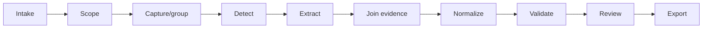

# Pipeline and state machine

## Pipeline stages



### 0. Intake

The selected adapter validates and stores screenshot, PDF, text, extension, or
controlled-browser evidence as `ingest-envelope.v1`. The same immutable artifact store and hash
rules apply to every channel.

Input-specific parsing may expose text, geometry, or semantic snapshots. It does not create a
correct-answer claim.

### 1. Scope

Input:

- source policy;
- allowed origin/path;
- capture mode;
- target deck/profile;
- retention and provider consent.

Output: immutable session scope.

### 2. Capture

For browser inputs, produces a capture bundle from a stable question/reveal state. For static
inputs, it selects and groups relevant pages, regions, or text blocks. It performs no semantic
answer inference.

### 3. Detect

Identifies candidate card family:

- radio group → likely single-choice or true/false;
- checkbox group → multiple-select;
- two-sided/reveal region → flashcard;
- paired columns/drag targets → matching;
- text input → typed;
- image plus masks/regions → image-occlusion.

Ambiguous candidates remain `unknown`; a model may classify from evidence but cannot override
hard contradictions such as checkbox semantics plus a single-answer-only target.

### 4. Extract

Field extraction priority:

1. visible DOM/ARIA;
2. local OCR;
3. optional vision.

Every field is a value plus evidence references, not a bare string.

### 5. Join evidence

Groups states by `questionFingerprint` and reconciles:

- question/options from the clean unanswered state;
- correct answers from the authoritative reveal state;
- explanations from visible solution content;
- source ordering and stable option IDs.

Contradictions create blocking issues.

### 6. Normalize

Allowed mechanical normalization:

- Unicode NFC/NFKC policy by field;
- whitespace collapse outside rich text;
- safe sub/sup/math representation;
- removal of navigation chrome;
- stable identifiers;
- language code normalization.

Disallowed:

- paraphrasing source content during extraction;
- correcting factual source keys silently;
- generating rationales/hints;
- changing a multi-answer key into a single answer.

### 7. Validate

Validation layers:

- Capture IR JSON Schema;
- cross-field invariants;
- evidence sufficiency;
- card-family invariants;
- target capability matrix;
- rights/publication policy;
- target deck/config schema;
- artifact existence and hash.

### 8. Review

The reviewer can:

- edit extracted text;
- choose/confirm answer evidence;
- reject false candidates;
- merge duplicates;
- select language/deck metadata;
- confirm rights basis;
- approve or quarantine each card.

Every semantic edit is recorded in the local review audit trail.

### 9. Export

Produces:

- deck JSON;
- optional `config.json`;
- `validation-report.json`;
- optional private evidence sidecar;
- optional media directory/zip.

No export is labeled compatible if it contains a capability the target does not support.

## Job state

```text
queued
→ running
→ awaiting_user | succeeded | failed | cancelled
```

Card draft state:

```text
detected
→ extracted
→ needs_review
→ approved | rejected
→ exported
```

Transitions are validated and idempotent. A retry creates a new attempt under the same job, not
a second card identity.

## Concurrency

- interactive capture is sequential per page;
- extraction of independent captures may run in a bounded pool;
- evidence joining serializes by `questionFingerprint`;
- export takes an immutable approved snapshot;
- cancellation is cooperative between stages and provider turns.

## Correctness tiers

| Tier | Meaning | Export |
|---|---|---|
| `source-verified` | visible authoritative reveal/key identifies answer | allowed |
| `reviewer-confirmed` | human explicitly confirms answer | allowed with audit |
| `source-ambiguous` | evidence conflicts or relies only on color/selection | blocked |
| `model-inferred` | model/domain knowledge supplied answer | blocked |
| `unknown` | no answer evidence | blocked |

## Enrichment as a separate pipeline

Optional hints, explanations, rationales, tags, or difficulty estimates run only after extraction
approval:

```text
approved source card
→ opt-in enrichment
→ generated fields marked as generated
→ subject review
→ merge into export
```

The original source field and generated field provenance remain distinct.
