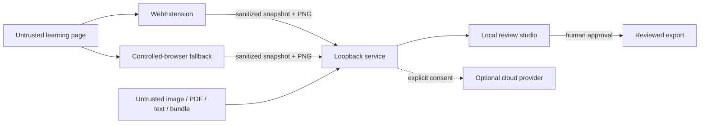

# Security, privacy, and legal boundaries

## Trust boundaries

The page, its text, DOM attributes, scripts, images, URLs, feedback, imported documents, extension
messages, and `.razcapture` archives are untrusted input.

## Threat model

### Prompt injection

A page may contain text instructing the model to reveal secrets, call tools, navigate elsewhere,
or change output.

Controls:

- page content is placed only in delimited data fields;
- model system instructions state that embedded instructions are untrusted;
- extraction model has no browser, shell, filesystem, or arbitrary network tools;
- strict JSON Schema output;
- deterministic validator and one bounded repair pass;
- provider secrets and system prompts never enter model input.

### Browser-session exposure

Controls:

- default extension access is temporary `activeTab`; observe grants are named-origin and
  revocable;
- no cookies, history, debugger, `webRequest`, or `<all_urls>` permission by default;
- capture stops on origin change and is always indicated visibly;
- dedicated browser profile with restrictive permissions;
- credentials entered only in the browser;
- password/form values, cookies, storage state, and authorization headers excluded;
- sanitized URLs strip userinfo, query, and fragment;
- no CDP port beyond loopback;
- explicit profile/evidence deletion;
- capture indicator and scoped origin.

### Extension and pairing compromise

Controls:

- content script exposes only an allowlisted message protocol;
- page scripts cannot directly trigger extension commands;
- every message validates version, tab, origin, command, nonce, and size;
- service-worker restart does not silently resume observe mode;
- pairing code is short-lived and rate-limited;
- capability token is scoped, revocable, absent from URLs/logs, and accepted only from the exact
  paired extension origin;
- artifact transfer commits only after declared hashes and sizes verify;
- no provider key or cloud call exists in the extension;
- Chrome/Firefox store signing plus reproducible packages.

### Malicious files and bundles

Controls:

- signature/media sniffing rather than filename trust;
- archive traversal, absolute path, symlink, and duplicate-entry rejection;
- PDF scripts, attachments, external links, and active content never execute;
- bounded decompression, bytes, pixels, selected pages, OCR time, and artifact count;
- immutable originals and hashes;
- sanitized text/markup before preview.

### Local API attacks

Controls:

- bind only `127.0.0.1`/`::1`;
- strict Host and Origin allowlists;
- random per-launch capability token kept in memory;
- no wildcard CORS or credentialed cross-origin requests;
- CSP and no remote script dependency;
- CSRF/DNS-rebinding protections;
- authenticated WebSocket handshake;
- rate, size, concurrency, and time limits;
- opaque path-traversal-safe IDs.

### SSRF/navigation abuse

Controls:

- browser URL policy validates scheme, origin, redirects, and resolved addresses;
- block browser-internal, `file:`, `javascript:`, and unexpected private-network targets;
- local fixture mode is explicit and cannot coexist with arbitrary remote navigation;
- no server-side URL fetcher in the core path;
- downloads/popups blocked unless user-approved.

### Untrusted content rendering

Controls:

- review UI renders text with text nodes;
- rich text is normalized to an allowlisted intermediate representation;
- HTML preview uses the same sanitized branded type/DOMPurify policy as razbiram.com;
- captured scripts/event handlers never execute;
- media MIME and pixel dimensions are validated.

## Privacy defaults

- no account or telemetry;
- no captured-content analytics, browsing-history marketing, or automatic razbiram.com upload;
- no automatic cloud upload;
- container crop before full-page screenshot;
- raw capture retention is temporary;
- successful export offers immediate evidence deletion and defaults to delete;
- keeping a local library is opt-in;
- logs contain IDs, timings, stage outcomes, and redacted errors, not raw page content;
- evidence export is separate, explicitly private, and never catalog content.
- Capture Lite bundles are local downloads; pairing is optional.

Before the first cloud call in a job, disclose:

- provider;
- exact crop/text categories leaving the machine;
- purpose;
- retention caveat/link;
- estimated cost if available.

Consent is per job/provider and revocable for later stages.

## Legal/source policy

The family rule is no scraping or unofficial endpoints. This tool therefore distinguishes
assistive capture from crawling:

- the user chooses the source and starts/stops capture;
- third-party pages are navigated by the user;
- the tool observes the visible current task container;
- it does not enumerate catalogs, call hidden APIs, bypass access controls, or auto-solve CAPTCHAs;
- automatic next-click recipes are restricted to first-party/permission-confirmed fixtures.

The software cannot determine copyright ownership. It records a rights basis:

- `user-authored`;
- `licensed`;
- `public-domain`;
- `permission-confirmed`;
- `personal-use-unconfirmed`;
- `unconfirmed`.

Only the first four may be marked approved for public/catalog publication. Personal/private
export can remain available subject to local law and source terms, but the UI must not imply that
access equals redistribution rights.

## Academic integrity

The tool converts material the user can already see. It does not:

- reveal hidden answers;
- solve live assessments from model knowledge;
- submit answers automatically on third-party platforms;
- bypass proctoring;
- claim an inferred answer is authoritative.

A source that does not reveal a solution yields a draft requiring human confirmation.

## Retention model

| Artifact | Default retention |
|---|---|
| Extension offline queue | until successful bundle/transfer, bounded; then delete |
| Imported image/PDF/text/bundle | until review/export, then delete |
| Browser profile | session or explicit persistent profile |
| Full viewport screenshot | until review/export, then delete |
| Question crop | until review/export, then delete |
| Semantic snapshot/OCR | until review/export, then delete |
| Approved deck | user-selected destination |
| Validation report | alongside export |
| Sanitized run metrics | local, configurable |

Deletion is recursive over an exact validated job/session directory and reports what was removed.

## Release security gate

Before release:

- threat-model review;
- adapted razbiram.com security checklist;
- origin/host/CSRF/DNS-rebinding tests;
- Chrome/Firefox permission-manifest diff and extension message tests;
- pairing token/origin/replay tests;
- `.razcapture` traversal, symlink, hash, and decompression tests;
- prompt-injection fixture suite;
- path traversal and decompression/image bomb tests;
- secrets scan;
- dependency audit and SBOM;
- retention/delete E2E test;
- cloud-consent E2E test;
- no raw private fixture in git history.
