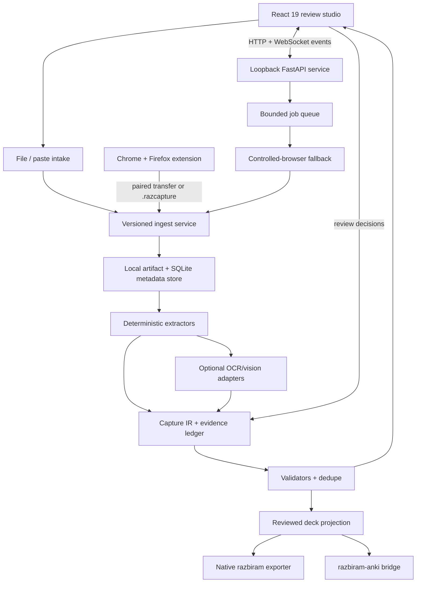

# Solution architecture

## Architecture goals

- accept screenshots, PDFs, text, and portable capture bundles;
- capture authenticated, user-authorized active tabs without handling credentials;
- extract structured content before invoking vision;
- preserve field-level evidence and uncertainty;
- reuse the existing razbiram card/runtime contracts;
- run locally without accounts or telemetry;
- keep browser, extraction, review, and export independently testable;
- allow provider and capture adapters without forking the core pipeline.

## Recommended shape



## Runtime choice

Use a Python 3.11+ local service, a React/TypeScript studio, and a small TypeScript WebExtension
core with Chrome and Firefox packaging.

Reasons:

- the evaluated screenshot-to-code donor already supplies useful FastAPI, Pydantic, Playwright,
  provider, image-normalization, and run-recording patterns in Python;
- razbiram-listen establishes the family pattern of a Python pipeline, CLI, local service, and
  bounded background jobs;
- Pydantic is a strong boundary for schema-constrained multimodal output;
- the browser extension communicates through a versioned protocol and does not require extraction
  or export to be duplicated in JavaScript.

This is not a license to port the whole upstream. The core should be a new, small package with
selective attributed ports. If the M0 spike finds a material Playwright capability gap in Python,
ADR-001 must be revisited before M1 rather than adding a second orchestrator.

## Logical components

### `razbiram_screen_to_learn.capture`

- session lifecycle;
- source-policy enforcement;
- browser adapters;
- DOM/ARIA semantic snapshot;
- screenshots and regions;
- question-state fingerprinting;
- capture artifact manifests.

### `razbiram_screen_to_learn.ingest`

- file signature, media, archive, size, and hash validation;
- screenshot/image normalization;
- PDF text-layer extraction and selected-page rendering;
- pasted text and sanitized markup parsing;
- `.razcapture` import;
- adapter-independent `ingest-envelope.v1` creation.

### `razbiram_screen_to_learn.pipeline`

- typed stage protocol;
- idempotent jobs;
- progress/cancel/retry;
- transition validation;
- run budgets.

### `razbiram_screen_to_learn.extract`

- deterministic DOM extractors;
- card-family classifier;
- field-level evidence creation;
- OCR and vision provider interfaces;
- source text normalization without semantic rewriting.

### `razbiram_screen_to_learn.review`

- review state and decisions;
- edit audit trail;
- answer confirmation;
- rights basis and retention decisions.

### `razbiram_screen_to_learn.contracts`

- Capture IR;
- evidence, artifact, review, and capability types;
- JSON Schemas;
- migration functions.

### `razbiram_screen_to_learn.export`

- current `studywithme-bg.learncard.v1` compatibility profile;
- current `config.json` profile;
- proposed hub-owned `razbiram.recall-deck.v1` reviewed-deck projection;
- razbiram-anki file/direct-handoff adapter;
- target capability matrix;
- validation and split/report generation.

### Studio

- local project/session setup;
- screenshot, PDF, text, and bundle drop zone;
- browser/extension pairing and inbox status;
- job queue;
- evidence/card review;
- deck organization;
- JSON and issue preview;
- retention/delete controls.

### `razbiram_screen_to_learn.api`

The loopback FastAPI service that brokers the studio and the extension:

- HTTP endpoints for artifact upload/download by opaque ID and hash;
- WebSocket channel for state, progress, and event delivery;
- strict `Host`, `Origin`, and capability-token enforcement;
- rate limiting for pairing and artifact endpoints;
- no internet exposure; binds to `127.0.0.1` only.

### `razbiram_screen_to_learn.jobs`

Bounded background job queue for pipeline execution:

- job lifecycle: queued → running → awaiting_user | succeeded | failed | cancelled;
- idempotent retries under the same job identity;
- maximum 2 concurrent extraction workers;
- cooperative cancellation checkpoint between every stage;
- cost ceiling enforcement for optional vision/model calls.

### `razbiram_screen_to_learn.pairing`

Manages the extension↔studio pairing protocol (ADR 007 public compatibility boundary):

- generates random loopback port and pairing code that encodes port + one-time token prefix;
- mints and revokes scoped capability tokens;
- verifies `chrome-extension://` and `moz-extension://` origin against the paired identity;
- rate-limits pairing attempts and expires codes after a short window;
- stores no secrets in logs, manifests, or frontend persistence.

### `razbiram_screen_to_learn.security`

Cross-cutting security enforcement:

- secret scanning and environment-based credential loading;
- archive path traversal and symlink rejection on `.razcapture` import;
- sanitized-markup enforcement on all captured HTML;
- permission audit and per-release budget check;
- no LLM provider key stored in the extension or logged.

### `razbiram_screen_to_learn.storage`

Local artifact and metadata persistence:

- content-addressed artifact store: write-once files keyed by SHA-256;
- SQLite metadata and state-transition log;
- hash verification on every read and after import;
- retention policy enforcement and session-evidence deletion;
- no absolute local paths in portable manifests or exported artifacts.

## Data plane and control plane

Large binary artifacts never travel as repeated base64 WebSocket payloads.

- HTTP streams upload/download artifacts by opaque ID.
- WebSocket messages carry state, progress, issue summaries, and artifact IDs.
- SQLite stores sanitized metadata and state transitions.
- Filesystem storage holds PNGs, DOM snapshots, crops, and exports under a job directory.
- The browser profile is separate from evidence storage and is never exportable.
- The extension transfers versioned manifests and chunked artifacts or downloads an immutable
  `.razcapture` bundle.

## Event envelope

```json
{
  "protocolVersion": "1.0",
  "eventId": "evt_...",
  "eventType": "draftCreated",
  "occurredAt": "2026-07-25T12:00:00Z",
  "sessionId": "ses_...",
  "jobId": "job_...",
  "captureId": "cap_...",
  "cardId": "q-0001",
  "data": {}
}
```

Core events:

- `sessionReady`, `navigationChanged`, `captureCandidateDetected`;
- `captureStarted`, `captureStored`, `captureRejected`;
- `extractionStarted`, `draftCreated`, `validationFailed`;
- `reviewRequired`, `cardApproved`, `cardRejected`;
- `exportStarted`, `exportBlocked`, `exportReady`;
- `jobCancelled`, `error`.

Events are append-only facts. Current UI state is derived from durable job/card records.

## Provider policy

Extraction uses the least-capable sufficient path:

1. deterministic DOM/ARIA;
2. local OCR for image-only text;
3. optional cloud vision after explicit per-job consent;
4. higher-accuracy model only for ambiguous structured extraction.

The model receives only the relevant crop and sanitized semantic snapshot. It has no shell,
filesystem, browser-navigation, or network tools. It returns strict JSON. A deterministic
validator is authoritative.

Extraction prompts must not generate rationales, hints, or explanations. Those belong to a
separate optional enrichment job with separate provenance and review.

## Availability and deployment

The standalone deployment is a local process:

```text
razbiram-screen-to-learn studio
  ├── starts loopback API on a random OS-assigned port
  ├── encodes port + token prefix in a short-lived pairing code (displayed in the UI)
  ├── mints an in-memory capability token
  ├── opens the local studio
  ├── exposes screenshot/PDF/text/bundle intake
  └── launches headed Chromium only as a fallback
```

Port discovery for the paired extension: the **pairing code encodes the port number and a
one-time token prefix**. The user enters or confirms the code in the extension popup; the
extension derives the loopback endpoint `http://127.0.0.1:{port}` and presents the full
capability token in the `Authorization` header on every request. Port secrecy is not a claimed
security property; the capability token is the authentication mechanism. Strict `Host` and
`Origin` header checks enforce that only the paired extension origin at that loopback address can
transfer artifacts. The port is session-scoped: a studio restart picks a new port and requires a
new pairing code. The extension's offline queue preserves captures as `.razcapture` bundles
during any gap so that a restart does not lose data. The pairing protocol is the public
compatibility boundary (ADR 007).

The separately distributed Chrome/Firefox extension works in Capture Lite without the studio by
downloading `.razcapture`. Paired mode connects to the loopback service after an explicit,
short-lived pairing flow. No hosted multi-user backend or razbiram.com account is assumed.
Container support is useful for CI, but a container is not the default interactive distribution
because file, browser, and extension integration are host-facing.

The Anki integration is downstream of approval. The first version downloads a reviewed-deck file
that razbiram-anki imports. A later exact-origin browser handshake can provide `Open in
razbiram-anki` without uploading the deck. `.apkg` generation remains owned and tested by
razbiram-anki.

## Performance budgets

Initial budgets:

- maximum 2 active extraction workers;
- maximum 1 interactive browser per session;
- maximum 500 cards per compatibility export;
- maximum 512 KiB final compatibility JSON unless the target contract changes;
- maximum 20 MiB per raw image before normalization;
- maximum 100 MiB and 200 selected pages per PDF at initial defaults;
- crop-first vision input;
- configurable job cost ceiling;
- cancellation checked between every stage and model turn;
- session evidence deleted by default after successful export, with an explicit keep option.

## Failure model

Every failure is classified:

- `source-policy`: origin or operation not permitted;
- `capture`: browser/DOM/screenshot failed;
- `ingest`: file/bundle invalid, unsupported, or over limit;
- `pairing`: extension protocol, origin, token, or transport rejected;
- `evidence`: answer missing or contradictory;
- `schema`: IR or target deck invalid;
- `capability`: target cannot render/evaluate the type;
- `rights`: publication basis absent;
- `provider`: OCR/model unavailable, invalid, or over budget;
- `storage`: artifact missing/hash mismatch;
- `internal`: invariant violation.

Only `provider` and selected transient `capture` failures are automatically retryable.
